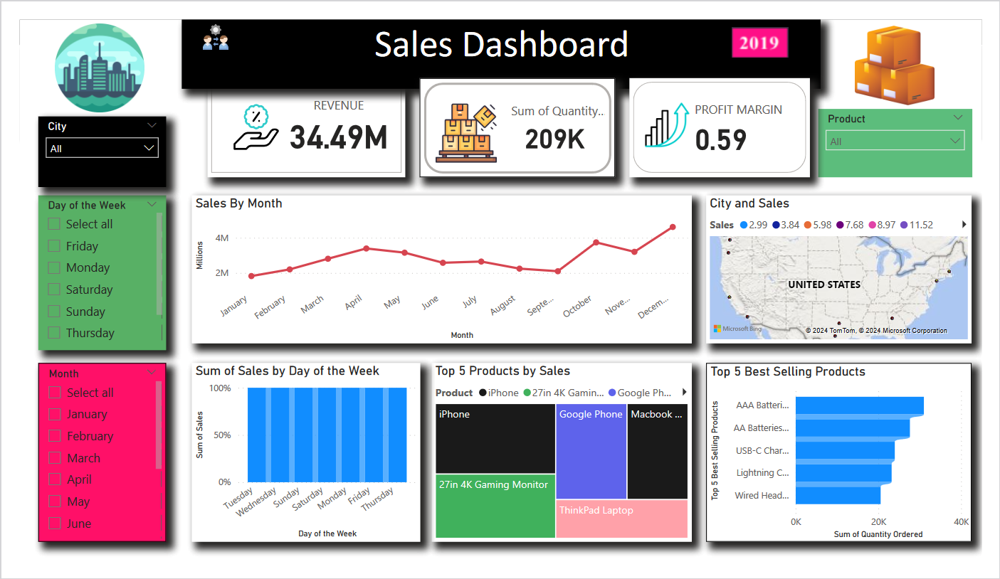

# SalesAnalysisProject
***

 ***
### Contents
- [Overview](#overview)
- [Project Objective](#projectobjective)
- [Data Overview](#dataoverview)
- [Key Findings](#keyfindings)
- [Conclusion](#conclusion)

***
### Overview
This project revolves around a comprehensive analysis of sales data aimed at extracting crucial insights for strategic business decisions. By leveraging Power BI, I conducted an in-depth examination of a substantial dataset, unveiling trends, identifying top-selling products, and calculating essential revenue metrics. This project underscores my expertise in navigating and interpreting extensive datasets, enabling me to provide actionable recommendations for enhancing sales strategies.

****

### Project Objective
The primary objective of this project was to conduct a thorough analysis of sales data, facilitating informed decision-making within the organization. Specifically, the goals were to:

* Identify sales trends over time.
* Determine top-selling products.
*  Calculate revenue metrics such as total sales and profit margins.
* Create visually compelling visualizations to communicate findings effectively.

***
### Data Overview
The sales dataset comprises 185,950 unique records spanning from January 1, 2019, to January 1, 2020. This dataset includes sales transactions for 19 distinct products distributed across 9 different cities.

***
### Key Findings
* Seasonal Sales Trends
Sales exhibit a seasonal pattern, with figures hitting their lowest point in January and gradually increasing throughout the year. The peak is observed in December, signaling a significant upward trajectory, especially in the fourth quarter.

* Regional Sales Distribution
San Francisco leads in sales volumes, closely followed by Los Angeles, New York City, Boston, and Atlanta. This highlights noticeable geographic variations in sales performance.

* Day-wise Sales Analysis
Tuesday emerges as the day with the highest sales figures, closely followed by Wednesday, while other weekdays exhibit relatively similar sales patterns.

* Key Performance Indicators (KPIs)
Total Revenue: $34.49 Million
Total Quantity Ordered: 209,000 units
Profit Margin: 59%
### Conclusion
The analysis of sales data in this project has yielded valuable insights into sales performance, seasonal trends, and product popularity. These findings provide a solid foundation for data-driven decision-making processes, aiming to optimize sales strategies and enhance overall business performance.
